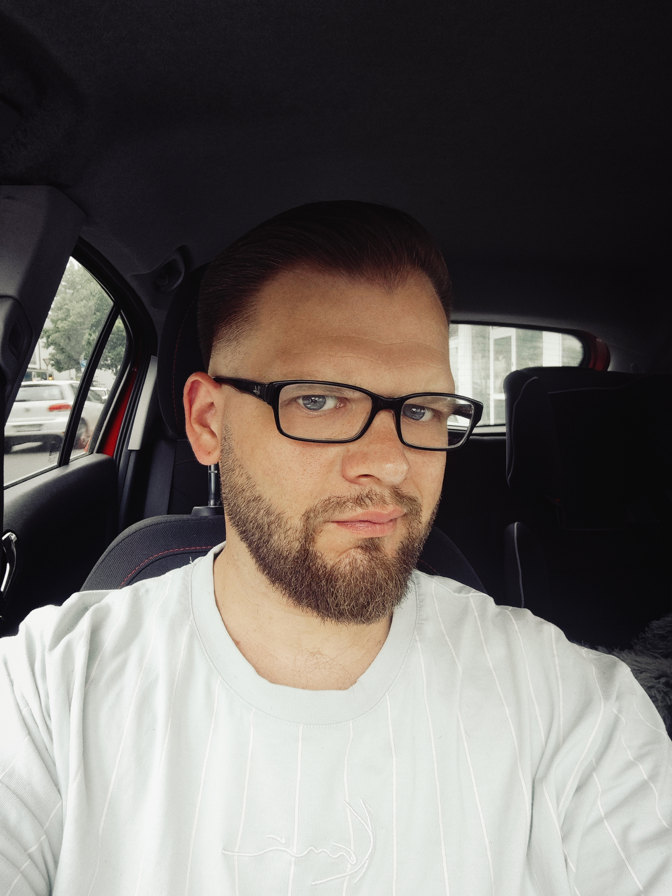

Mut wird belohnt ... oder zumindest mit einem netten Gespräch. 😉

  

Ich bin Robin, 33 Jahre alt und alleinerziehender Single-Papa.

  

Dieser QR-Code ist mein erster Schritt.

  

Ob du den zweiten gehst, entscheidest du. 😉

  

Sprich mich an oder schreib mir auf Instagram.

<a class="button" href="https://www.instagram.com/robinri_/" target="_blank">
📷 Zu meinem Instagram
</a>

P.S.: Falls du den QR-Code zufällig gefunden hast: Willkommen. Vielleicht sollte es genau so sein. 😉

